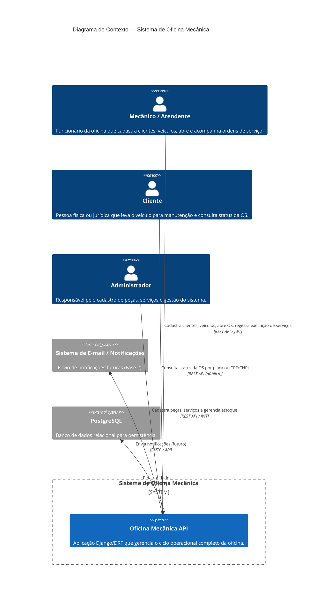
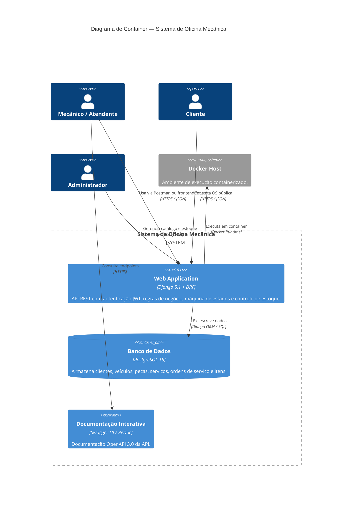
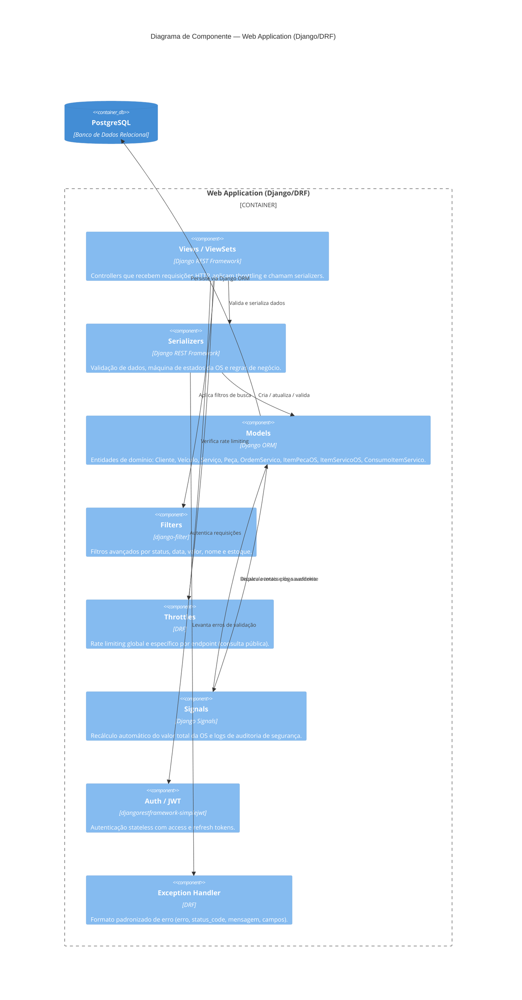
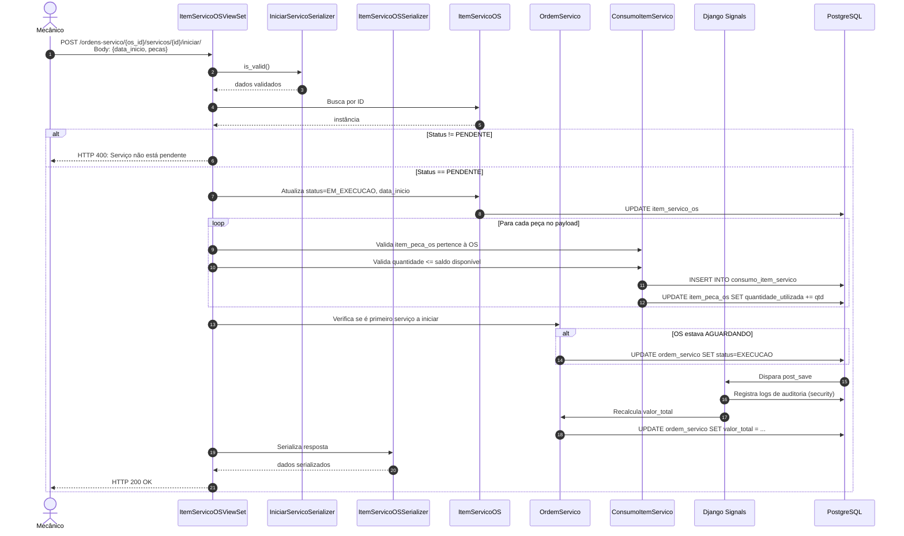

# C4 Model — Oficina Mecânica API

Este documento apresenta os quatro níveis do **C4 Model** para o sistema de gerenciamento de oficina mecânica.

> **Duas opções de renderização:**
>
> **Opção A — PlantUML (mais rico visualmente):**
> 1. Acesse [PlantText](https://www.planttext.com/) ou [PlantUML Online](https://www.plantuml.com/plantuml/)
> 2. Cole o código PlantUML
> 3. Clique em **Submit** para gerar a imagem
>
> **Opção B — Mermaid (funciona no GitHub/Notion/VS Code):**
> 1. Acesse [Mermaid Live Editor](https://mermaid.live/)
> 2. Cole o código Mermaid
> 3. A imagem gera automaticamente

---

## Nível 1 — Diagrama de Contexto (System Context)

Mostra o sistema como uma caixa preta e seus usuários/sistemas externos.

### PlantUML

```plantuml
@startuml
!include https://raw.githubusercontent.com/plantuml-stdlib/C4-PlantUML/master/C4_Context.puml

LAYOUT_WITH_LEGEND()

title Diagrama de Contexto — Sistema de Oficina Mecânica

Person(mecanico, "Mecânico / Atendente", "Funcionário da oficina que cadastra clientes, veículos, abre e acompanha ordens de serviço.")
Person(cliente, "Cliente", "Pessoa física ou jurídica que leva o veículo para manutenção e consulta status da OS.")
Person(admin, "Administrador", "Responsável pelo cadastro de peças, serviços e gestão do sistema.")

System_Boundary(sistema, "Sistema de Oficina Mecânica") {
    System(oficina_api, "Oficina Mecânica API", "Aplicação Django/DRF que gerencia o ciclo operacional completo da oficina.")
}

System_Ext(email, "Sistema de E-mail / Notificações", "Envio de notificações futuras (Fase 2).")
System_Ext(postgresql, "PostgreSQL", "Banco de dados relacional para persistência.")

Rel(mecanico, oficina_api, "Cadastra clientes, veículos, abre OS, registra execução de serviços", "REST API / JWT")
Rel(cliente, oficina_api, "Consulta status da OS por placa ou CPF/CNPJ", "REST API (público)")
Rel(admin, oficina_api, "Cadastra peças, serviços e gerencia estoque", "REST API / JWT")
Rel(oficina_api, postgresql, "Persiste dados", "SQL / TCP")
Rel(oficina_api, email, "Envia notificações (futuro)", "SMTP / API")

@enduml
```

### Mermaid



**Imagem renderizada:**


---

## Nível 2 — Diagrama de Container (Container Diagram)

Mostra as aplicações e data stores dentro do sistema.

### PlantUML

```plantuml
@startuml
!include https://raw.githubusercontent.com/plantuml-stdlib/C4-PlantUML/master/C4_Container.puml

LAYOUT_WITH_LEGEND()

title Diagrama de Container — Sistema de Oficina Mecânica

Person(mecanico, "Mecânico / Atendente")
Person(cliente, "Cliente")
Person(admin, "Administrador")

System_Boundary(sistema, "Sistema de Oficina Mecânica") {
    Container(web_app, "Web Application", "Django 5.1 + DRF", "API REST com autenticação JWT, regras de negócio, máquina de estados e controle de estoque.")
    Container(db, "Banco de Dados", "PostgreSQL 15", "Armazena clientes, veículos, peças, serviços, ordens de serviço e itens.")
    Container(swagger, "Documentação Interativa", "Swagger UI / ReDoc", "Documentação OpenAPI 3.0 da API.")
}

System_Ext(docker, "Docker Host", "Ambiente de execução containerizado.")

Rel(mecanico, web_app, "Usa via Postman ou frontend futuro", "HTTPS / JSON")
Rel(cliente, web_app, "Consulta OS pública", "HTTPS / JSON")
Rel(admin, web_app, "Gerencia catálogo e estoque", "HTTPS / JSON")
Rel(web_app, db, "Lê e escreve dados", "Django ORM / SQL")
Rel(mecanico, swagger, "Consulta endpoints", "HTTPS")
Rel(web_app, docker, "Executa em container", "Docker Runtime")

@enduml
```

### Mermaid



**Imagem renderizada:**


---

## Nível 3 — Diagrama de Componente (Component Diagram)

Mostra os componentes principais dentro da aplicação Web (Django).

### PlantUML

```plantuml
@startuml
!include https://raw.githubusercontent.com/plantuml-stdlib/C4-PlantUML/master/C4_Component.puml

LAYOUT_WITH_LEGEND()

title Diagrama de Componente — Web Application (Django/DRF)

Container_Boundary(web_app, "Web Application (Django/DRF)") {
    Component(views, "Views / ViewSets", "Django REST Framework", "Controllers que recebem requisições HTTP, aplicam throttling e chamam serializers.")
    Component(serializers, "Serializers", "Django REST Framework", "Validação de dados, máquina de estados da OS e regras de negócio.")
    Component(models, "Models", "Django ORM", "Entidades de domínio: Cliente, Veículo, Serviço, Peça, OrdemServico, ItemPecaOS, ItemServicoOS, ConsumoItemServico.")
    Component(filters, "Filters", "django-filter", "Filtros avançados por status, data, valor, nome e estoque.")
    Component(throttles, "Throttles", "DRF", "Rate limiting global e específico por endpoint (consulta pública).")
    Component(signals, "Signals", "Django Signals", "Recálculo automático do valor total da OS e logs de auditoria de segurança.")
    Component(auth, "Auth / JWT", "djangorestframework-simplejwt", "Autenticação stateless com access e refresh tokens.")
    Component(exceptions, "Exception Handler", "DRF", "Formato padronizado de erro (erro, status_code, mensagem, campos).")
}

ContainerDb(db, "PostgreSQL", "Banco de Dados Relacional")

Rel(views, serializers, "Valida e serializa dados")
Rel(views, filters, "Aplica filtros de busca")
Rel(views, throttles, "Verifica rate limiting")
Rel(views, auth, "Autentica requisições")
Rel(serializers, models, "Cria / atualiza / valida")
Rel(serializers, exceptions, "Levanta erros de validação")
Rel(models, signals, "Dispara eventos pós-save/delete")
Rel(signals, models, "Recalcula totais e loga auditoria")
Rel(models, db, "Persiste via Django ORM")

@enduml
```

### Mermaid



**Imagem renderizada:**


---

## Nível 4 — Diagrama de Código / Sequência (Code Level)

Exemplo de fluxo detalhado: **Início de execução de um serviço na OS**.

### PlantUML

```plantuml
@startuml
!include https://raw.githubusercontent.com/plantuml-stdlib/C4-PlantUML/master/C4_Dynamic.puml

title Diagrama de Sequência — Iniciar Serviço na OS

Participant(mecanico, "Mecânico", "Usuário")
Container_Boundary(api, "API Django/DRF") {
    Participant(view, "ItemServicoOSViewSet", "View")
    Participant(serializer, "ItemServicoOSSerializer", "Serializer")
    Participant(service_serializer, "IniciarServicoSerializer", "Serializer")
    Participant(model, "ItemServicoOS", "Model")
    Participant(os_model, "OrdemServico", "Model")
    Participant(signal, "Signals", "Django Signals")
}
ContainerDb(db, "PostgreSQL", "Banco de Dados")

Rel(mecanico, view, "POST /ordens-servico/{id}/servicos/{id}/iniciar/")
Rel(view, service_serializer, "Valida payload (data_inicio, pecas)")
Rel(view, model, "Busca ItemServicoOS")
Rel(model, os_model, "Verifica status da OS")
Rel(model, db, "Atualiza status → EM_EXECUCAO, data_inicio")
Rel(model, db, "Cria ConsumoItemServico (peças consumidas)")
Rel(db, os_model, "Atualiza OS → EXECUCAO (se primeiro serviço)")
Rel(os_model, signal, "Dispara signal post_save")
Rel(signal, db, "Registra log de auditoria")
Rel(view, mecanico, "Retorna 200 OK com dados atualizados")

@enduml
```

### Mermaid (Sequence Diagram)



**Imagem renderizada:**


---

## Instruções de Renderização

### PlantUML

| Ferramenta | URL | Passo a passo |
|---|---|---|
| **PlantText** | https://www.planttext.com/ | Cole o código → clique **Refresh** → clique direito na imagem para salvar |
| **PlantUML Online** | https://www.plantuml.com/plantuml/ | Cole o código na caixa de texto → a imagem gera automaticamente |
| **VS Code** | Extensão "PlantUML" | Cole em um arquivo `.puml` → Alt+D para preview |
| **IntelliJ / PyCharm** | Extensão "PlantUML Integration" | Mesmo fluxo do VS Code |

### Mermaid

| Ferramenta | URL | Passo a passo |
|---|---|---|
| **Mermaid Live Editor** | https://mermaid.live/ | Cole o código → imagem gera em tempo real → clique em **PNG/SVG** para exportar |
| **GitHub** | README ou arquivos `.md` | Cole o código em um bloco ` ```mermaid ` → renderiza automaticamente |
| **Notion** | Bloco de código | Cole o código e mude a linguagem para "Mermaid" |
| **VS Code** | Extensão "Markdown Preview Mermaid Support" | Preview em tempo real |

---

## Nomes sugeridos para as imagens

Após gerar as imagens, salve-as em `docs/images/` com os nomes:

| Nível | PlantUML | Mermaid |
|---|---|---|
| 1 — Contexto | `c4-nivel1-contexto-plantuml.png` | `c4-nivel1-contexto-mermaid.png` |
| 2 — Container | `c4-nivel2-container-plantuml.png` | `c4-nivel2-container-mermaid.png` |
| 3 — Componente | `c4-nivel3-componente-plantuml.png` | `c4-nivel3-componente-mermaid.png` |
| 4 — Sequência | `c4-nivel4-sequencia-plantuml.png` | `c4-nivel4-sequencia-mermaid.png` |

E referencie no documento com:
```markdown

```
