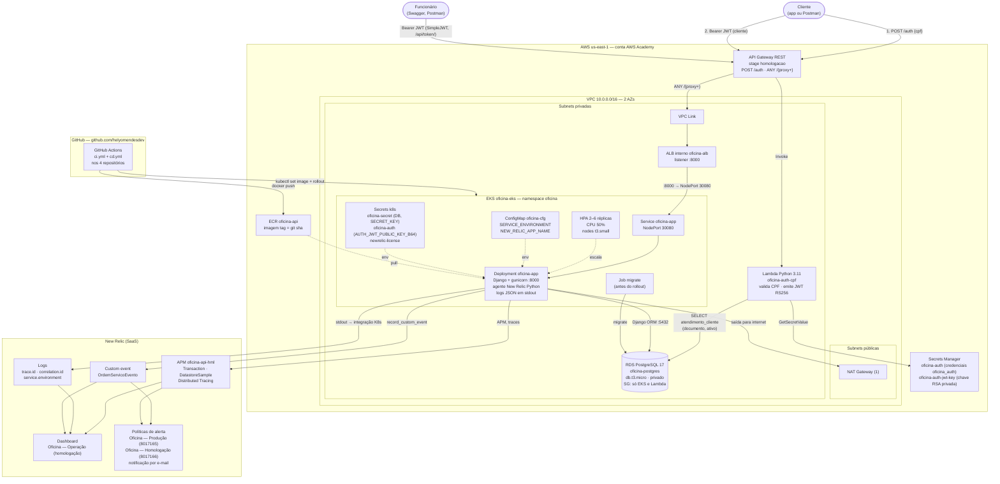

# Diagrama de Componentes — Nuvem, APIs, Banco e Monitoramento

| Informação | Valor |
|---|---|
| **Documento** | Diagrama de componentes da Fase 3 (AWS us-east-1) |
| **Versão** | 1.0 |
| **Data** | 2026-09-09 |
| **Autores** | Grupo 80 — Hélio Mendes da Silva (RM374170), Lucas Marques (RM369825), Luís Fernando Montes (RM367183), Sophia Sussa Campos Bastos (RM371864) |
| **Complementa** | [C4 Model](c4-model.md) (níveis 1–4 da aplicação), [`docs/fase3/observabilidade/README.md` §3](../fase3/observabilidade/README.md) |

---

## 1. O que muda em relação ao C4 da Fase 2

O [C4 Model](c4-model.md) descreve a aplicação de dentro para fora: views, serializers, models,
banco. Este documento descreve **onde isso roda** na Fase 3 e o que existe ao redor: rede,
entrada, autenticação serverless, banco gerenciado e a camada de monitoramento. Tudo abaixo foi
provisionado em AWS Academy, região `us-east-1`, ambiente de homologação — os nomes são os
reais.

## 2. Diagrama

Legenda: setas contínuas são tráfego em tempo de execução ou deploy; setas tracejadas são
configuração ou escala. Os números 1 e 2 nas setas do cliente correspondem aos dois fluxos de
[`diagrama-sequencia-autenticacao.md`](diagrama-sequencia-autenticacao.md).

## 3. Componente → repositório responsável

Os quatro repositórios estão em `github.com/helyomendesdev`, cada um com `ci.yml` e `cd.yml`
próprios ([`docs/fase3/estrutura-repositorios.md`](../fase3/estrutura-repositorios.md)).

| Componente | Repositório | Como é provisionado / entregue | Responsável |
|---|---|---|---|
| Aplicação Django, Dockerfile, manifests `k8s/` da app (Deployment, Service, HPA, ConfigMap, Job de migrate) | `tech-challenge-oficina` | `cd.yml`: build → push ECR → `kubectl set image` no EKS | Equipe de aplicação |
| Instrumentação: agente New Relic, `app/observabilidade/`, `ObservabilidadeAdapter`, `observabilidade/dashboards/` e `observabilidade/alertas/` | `tech-challenge-oficina` | Código da app + JSON versionado; políticas criadas via NerdGraph | Luís Fernando Montes |
| Lambda `oficina-auth-cpf` (Python 3.11), API Gateway REST (`/auth`, `/{proxy+}`), VPC Link, Secrets Manager `oficina-auth` e `oficina-auth-jwt-key` | `tech-challenge-oficina-auth` | Terraform + `cd.yml` empacotando a function | Lucas Marques |
| VPC 10.0.0.0/16, subnets, NAT, EKS `oficina-eks`, node group t3.small, ECR `oficina-api`, ALB interno `oficina-alb`, security groups, Secret k8s `oficina-auth` e `newrelic-license` | `tech-challenge-oficina-k8s` | Terraform | Sophia Sussa Campos Bastos |
| RDS PostgreSQL 17 `oficina-postgres` (db.t3.micro, privado), subnet group, parameter group, SG autorizando EKS e Lambda, usuário `oficina_auth` | `tech-challenge-oficina-database` | Terraform | Sophia Sussa Campos Bastos |
| Conta New Relic, dashboard "Oficina — Operação (homologação)", políticas "Oficina — Produção" e "Oficina — Homologação", canal de e-mail | — (SaaS; definição versionada em `tech-challenge-oficina/observabilidade/`) | Interface + NerdGraph a partir de `condicoes.json` | Luís Fernando Montes |
| Governança: nomes, branches `develop`/`main`, proteção por PR, ambientes `homologacao`/`producao` nos 4 repos | todos | Configuração do GitHub | Hélio Mendes da Silva |

## 4. Fronteiras de rede que o diagrama impõe

| Fronteira | Regra | Consequência prática |
|---|---|---|
| Internet → aplicação | Só pelo API Gateway. O ALB é interno e não tem IP público | Não existe URL direta para o pod; o Swagger é acessado via `https://<api-id>.execute-api.us-east-1.amazonaws.com/homologacao/api/schema/swagger-ui/` |
| Gateway → ALB | VPC Link para o ALB interno na porta 8000 | O Gateway é o único cliente do ALB |
| ALB → pods | Target group nos nodes, NodePort 30080, health check nas probes da app | O security group dos nodes precisa aceitar 30080 do SG do ALB (corrigido em 2026-09-02, ver `integracao-repositorios.md`) |
| EKS e Lambda → RDS | Security group do RDS aceita 5432 apenas do SG do cluster e do SG da Lambda | Nenhum desenvolvedor acessa o banco de fora da VPC sem bastion ou túnel |
| Pods → internet | Via NAT único nas subnets públicas | É por aqui que o agente New Relic envia dados (HTTPS 443) e que o `SimuladorOrcamentoService` chamaria um webhook externo |
| Lambda → Secrets Manager | Lambda em subnets privadas; sai pelo NAT ou por VPC endpoint | Chave privada nunca entra em variável de ambiente nem em repositório |

## 5. Monitoramento — o que cada componente envia

| Componente | O que envia | Para onde | Como filtra ambiente |
|---|---|---|---|
| Pods Django | Transações, spans, tempo em banco (`Transaction`, `DatastoreSample`) | New Relic APM `oficina-api-hml` | `appName` |
| Pods Django | Uma linha JSON por requisição e por evento, em stdout, com `trace.id`, `span.id`, `request.id`, `correlation.id` | New Relic Logs (via integração Kubernetes) | `service.environment` |
| `ObservabilidadeAdapter` | `OrdemServicoEvento` a cada abertura, transição, conclusão e falha de OS | New Relic custom events | `service.environment` |
| Dashboard | D1 volume diário, D2 tempo médio por status, D3 erros de integração, D4 latência, D5 Kubernetes | "Oficina — Operação (homologação)" | consulta por consulta |
| Políticas de alerta | A1 falha no processamento de OS, A2 taxa de erro, A3 latência (dado disponível hoje); A5–A8 aguardam `nri-bundle`, layer da Lambda e integração RDS | "Oficina — Produção" e "Oficina — Homologação", e-mail | NRQL de cada condição |

Detalhes, NRQL e o que ainda depende de infraestrutura estão em
[`docs/fase3/observabilidade/README.md`](../fase3/observabilidade/README.md) §5–§7 e em
`observabilidade/alertas/condicoes.json`.

## 6. Limitações desta versão

- **Ambiente efêmero.** AWS Academy encerra sessões; `<api-id>` do Gateway, endpoint do RDS e
  nodes mudam a cada recriação. Por isso o alerta A4 (Synthetics contra URL pública fixa) não
  foi criado.
- **Um ambiente provisionado.** O diagrama mostra homologação. Produção usa a mesma topologia
  com `SERVICE_ENVIRONMENT=producao`, `NEW_RELIC_APP_NAME=oficina-api-prd` e stage próprio no
  Gateway; ainda não foi levantada em paralelo por causa do teto de crédito.
- **`nri-bundle`, layer New Relic na Lambda e integração AWS→New Relic** não estão instalados;
  D5 e os alertas A5–A8 ficam sem dado até que estejam.

## 7. Referências

- [`diagrama-sequencia-autenticacao.md`](diagrama-sequencia-autenticacao.md) — fluxos 1 e 2 em detalhe
- [`diagrama-sequencia-abertura-os.md`](diagrama-sequencia-abertura-os.md) — de onde sai o `OrdemServicoEvento`
- [RFC-005 — Escolha da nuvem](../rfcs/rfc-005-escolha-nuvem-aws.md), [RFC-006 — Autenticação CPF + JWT](../rfcs/rfc-006-autenticacao-cpf-jwt.md) e [Justificativa do banco](../justificativa-banco-dados.md)
- [ADR-006 — CI/CD AWS](../adrs/adr-006-cicd-aws-ecr-eks.md), [ADR-008 — Observabilidade](../adrs/adr-008-observabilidade-new-relic.md)
- [`docs/fase3/integracao-repositorios.md`](../fase3/integracao-repositorios.md) — decisões de 2026-09-02 e correções de rede

## 8. Histórico de Revisões

| Versão | Data | Autor | Descrição |
|---|---|---|---|
| 1.0 | 2026-09-09 | Luís Fernando Montes | Versão inicial, a partir do ambiente de homologação provisionado |
