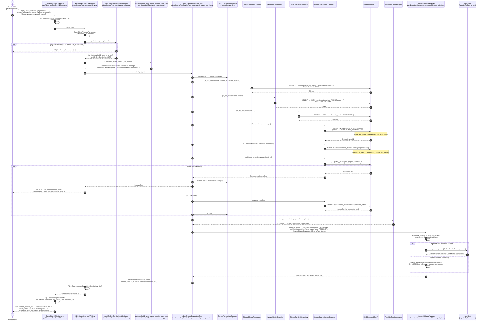

# Diagrama de Sequência — Abertura de Ordem de Serviço

| Informação | Valor |
|---|---|
| **Documento** | Diagrama de sequência — abertura de OS com evento de negócio (Fase 3) |
| **Versão** | 1.0 |
| **Data** | 2026-09-09 |
| **Autores** | Grupo 80 — Hélio Mendes da Silva (RM374170), Lucas Marques (RM369825), Luís Fernando Montes (RM367183), Sophia Sussa Campos Bastos (RM371864) |
| **Endpoint retratado** | `POST /api/v1/ordens-servico/abrir/` |

---

## 1. Qual abertura este diagrama descreve

A aplicação tem **dois** caminhos para abrir uma OS, e só um deles emite o evento de negócio:

| Endpoint | Caminho no código | Emite `OrdemServicoEvento`? |
|---|---|---|
| `POST /api/v1/ordens-servico/abrir/` (Fase 2) | `AbrirOrdemServicoAPIView` → `AbrirOrdemServicoUseCase` → repositories | **Sim** — `evento = 'ABERTURA'` |
| `POST /api/v1/ordens-servico/` (Fase 1, legado) | `OrdemServicoViewSet` → `OwnedQuerySetMixin.perform_create` → `OrdemServicoSerializer.save()` | Não — só o log de auditoria `os_created` do signal `audit_log_os_save` |

Este documento cobre o primeiro, que é o fluxo do enunciado da Fase 3 e o que alimenta o
dashboard D1 (volume diário). O fluxo legado está descrito no
[HLD §4.1](../design/hld.md). O gerador de carga
(`scripts/gerar_carga_observabilidade.py`) usa o endpoint `/abrir/`.

Todos os nomes de classes e arquivos abaixo existem no código; nada foi abstraído.

## 2. Sequência



## 3. Decisões que o diagrama torna visíveis

**A view é fina.** `AbrirOrdemServicoAPIView.post` faz quatro coisas: valida o payload, monta o
DTO, chama o use case e serializa a saída. Regra de negócio, transação e evento vivem no use
case — é a separação da [ADR-005](../adrs/adr-005-arquitetura-hexagonal-clean.md).

**A transação termina antes do evento.** `_notificar_orcamento` e `_registrar_evento_abertura`
são chamados **depois** do `with self.transaction_manager.atomic()`. Consequências:

- Se o INSERT falhar (passos 31–36), nenhum evento é emitido — o dashboard D1 conta só
  aberturas que existem no banco.
- Se o New Relic falhar (indisponível, agente inativo), a OS já está gravada e a resposta
  continua `201`. O adapter captura a exceção, loga um `WARNING` e cai para o log JSON
  (passo 46). Observabilidade nunca derruba a requisição.

**O evento é emitido pelo use case, não pela view nem pelo signal.** É a decisão registrada em
[`docs/fase3/observabilidade/README.md` §8, item 6](../fase3/observabilidade/README.md).
O signal `audit_log_os_save` continua existindo, mas é auditoria de segurança (OWASP A09), com
outro logger e outro propósito.

**`statusAnterior` é `None` e `duracaoStatusSegundos` é `0.0`.** Abertura não é transição: não
há status anterior a medir. O D2 (tempo médio por status) filtra `evento IN ('TRANSICAO',
'CONCLUSAO')` justamente para não contar aberturas como duração zero.

**Reserva de estoque continua em `ItemPecaOS.save()`.** O repository chama
`ItemPecaOS.objects.create(...)`, e é o `save()` do model que debita `Peca.estoque_atual` e
levanta `ValidationError` quando não há saldo. O repository traduz isso para
`EstoqueInsuficienteError` (subclasse de `DomainError`). É uma dívida consciente documentada no
[README — Arquitetura híbrida](../../README.md#fase-2--arquitetura-híbrida-pragmática); o
caminho de migração está nos `TODO` de `atendimento/models.py`.

## 4. Campos do evento emitido

O dicionário que chega ao New Relic como `OrdemServicoEvento`, no caso de abertura:

| Atributo | Valor na abertura | Origem |
|---|---|---|
| `evento` | `ABERTURA` | `AbrirOrdemServicoUseCase._registrar_evento_abertura` |
| `osId` | id da OS criada | idem |
| `statusAnterior` | `None` | idem |
| `statusNovo` | `RECEBIDA` | `OrdemServico.status` (default do model) |
| `duracaoStatusSegundos` | `0.0` | use case |
| `erroTipo` | `None` | use case |
| `traceId` | trace corrente | `ObservabilidadeAdapter` via `trace_e_span()` — agente primeiro, contextvars depois |
| `service.environment` | `homologacao` ou `producao` | `ObservabilidadeAdapter` via `settings.SERVICE_ENVIRONMENT` (ConfigMap) |

O contrato completo está em `atendimento/application/ports/observabilidade_port.py` e em
[`docs/fase3/observabilidade/README.md` §5.4](../fase3/observabilidade/README.md). A NRQL do D1
que consome esse evento:

```sql
SELECT count(*) FROM OrdemServicoEvento
WHERE evento = 'ABERTURA' AND service.environment = 'homologacao'
TIMESERIES 1 day SINCE 30 days ago
```

## 5. Referências

- [HLD §4.1](../design/hld.md) — fluxo legado `POST /api/v1/ordens-servico/`
- [LLD §3](../design/lld.md) — sequências de iniciar e finalizar serviço
- [`docs/arquitetura/diagrama-componentes-nuvem.md`](diagrama-componentes-nuvem.md) — onde pod, banco e New Relic vivem
- [ADR-008](../adrs/adr-008-observabilidade-new-relic.md) — por que New Relic e agente nativo
- `atendimento/tests/application/test_observabilidade_events.py` — testes que travam o formato do evento

## 6. Histórico de Revisões

| Versão | Data | Autor | Descrição |
|---|---|---|---|
| 1.0 | 2026-09-09 | Luís Fernando Montes | Versão inicial, conferida contra `AbrirOrdemServicoAPIView`, `AbrirOrdemServicoUseCase`, `DjangoOrdemServicoRepository` e `ObservabilidadeAdapter` |
