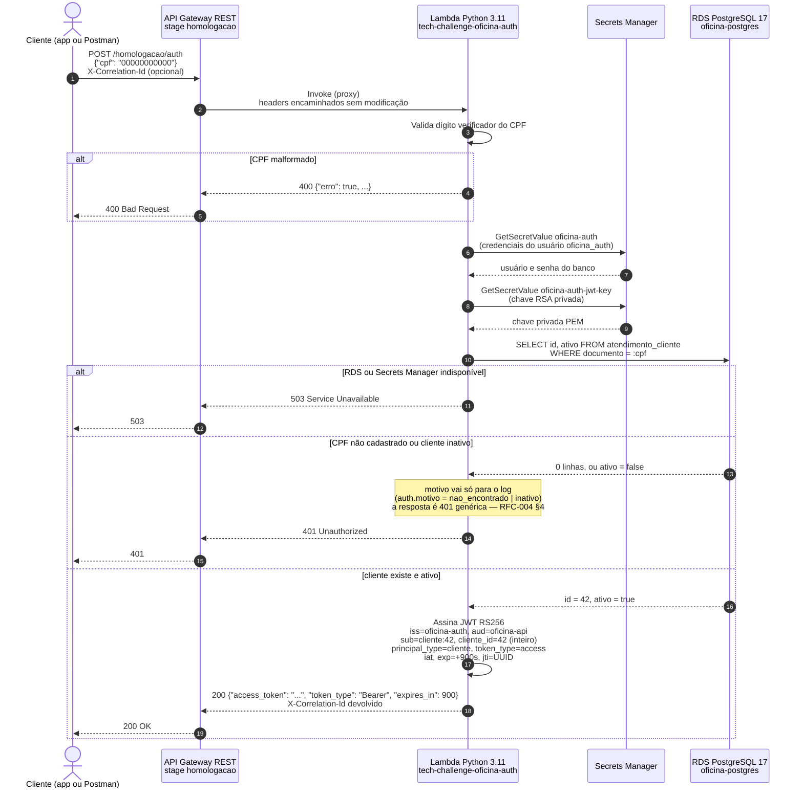
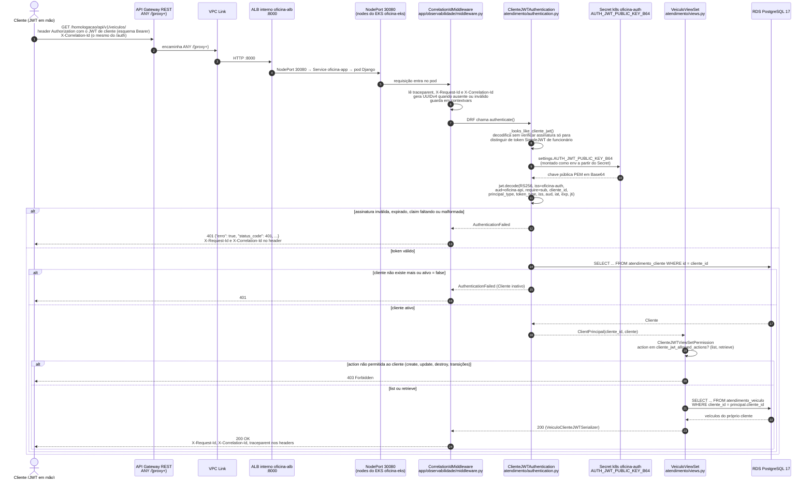

# Diagrama de Sequência — Autenticação por CPF e Primeiro Consumo Protegido

| Informação | Valor |
|---|---|
| **Documento** | Diagrama de sequência — fluxo de autenticação (Fase 3) |
| **Versão** | 1.0 |
| **Data** | 2026-09-09 |
| **Autores** | Grupo 80 — Hélio Mendes da Silva (RM374170), Lucas Marques (RM369825), Luís Fernando Montes (RM367183), Sophia Sussa Campos Bastos (RM371864) |
| **Ambiente retratado** | AWS us-east-1, stage `homologacao` do API Gateway |

---

## 1. O que este documento cobre

Dois fluxos que **saem do API Gateway de forma independente** — não uma cadeia única (ver
[ADR-007 §1](../adrs/adr-007-correlacao-w3c-trace-context.md)):

1. **Autenticação** (`POST /auth`): o cliente informa o CPF, a Lambda de autenticação
   (repositório `tech-challenge-oficina-auth`) confere existência e situação do cliente no RDS e
   devolve um JWT RS256.
2. **Primeiro consumo protegido** (`GET /api/v1/veiculos/`, por exemplo): o cliente apresenta o
   JWT, o API Gateway encaminha pelo VPC Link até o ALB interno e os pods Django validam a
   assinatura com a chave pública em `atendimento/authentication.py`.

Componentes e nomes vêm do ambiente real de homologação. O que ainda não está provisionado ou
está fora deste repositório aparece indicado.

## 2. Fluxo 1 — Autenticação por CPF

### Regras que o diagrama codifica

| Passo | Regra | Onde está |
|---|---|---|
| 3–4 | CPF com dígito verificador inválido é `400` antes de qualquer acesso a segredo ou banco | Lambda (`tech-challenge-oficina-auth`) |
| 5–8 | Dois segredos distintos: credencial do banco e chave de assinatura. Nenhum vive em variável de ambiente nem em repositório | Secrets Manager `oficina-auth` e `oficina-auth-jwt-key` |
| 9 | A Lambda lê apenas a tabela `atendimento_cliente`, com o usuário `oficina_auth`, de dentro das subnets privadas; o security group do RDS aceita só EKS e Lambda | Repositório `tech-challenge-oficina-database` |
| 12–14 | CPF inexistente e cliente inativo recebem o **mesmo** `401`. Devolver `404` ou `403` transformaria o endpoint em oráculo de enumeração de clientes | [RFC-004 §4, regra 4](../rfcs/rfc-004-logs-estruturados-json.md) |
| 17 | `cliente_id` é inteiro e `sub` é `cliente:<id>`; a aplicação rejeita qualquer outra forma | `atendimento/authentication.py` (`_validate_claims`) |
| 18 | `expires_in` = 900 s. Não há refresh token para cliente — expirou, autentica de novo | Contrato em [`docs/fase3/integracao-repositorios.md`](../fase3/integracao-repositorios.md) |

## 3. Fluxo 2 — Primeiro consumo protegido com o token

### Regras que o diagrama codifica

| Passo | Regra | Onde está |
|---|---|---|
| 1–4 | Nada chega ao pod sem passar por API Gateway → VPC Link → ALB interno → NodePort. O ALB não tem IP público; a única porta de entrada é o Gateway | Repositório `tech-challenge-oficina-k8s` |
| 6 | O middleware é o **primeiro** item de `MIDDLEWARE`; tudo que a requisição loga a partir daqui carrega `trace.id`, `span.id`, `request.id` e `correlation.id` | `app/observabilidade/middleware.py`, [RFC-004 §7](../rfcs/rfc-004-logs-estruturados-json.md) |
| 8 | A pré-inspeção sem assinatura serve apenas para decidir **qual** autenticador trata o token. A autorização nunca depende dela | `ClienteJWTAuthentication._looks_like_cliente_jwt` |
| 9–11 | A chave pública entra pelo Secret Kubernetes `oficina-auth`; a chave privada nunca sai do Secrets Manager da Lambda | `k8s/` no repositório `tech-challenge-oficina-k8s`; `app/settings.py` (`AUTH_JWT_PUBLIC_KEY_B64`) |
| 15–17 | Mesmo com JWT válido, o cliente precisa continuar existindo e ativo no banco no momento da chamada. Desativar um cliente revoga o acesso sem esperar os 900 s | `ClienteJWTAuthentication._get_cliente_ativo` |
| 19–22 | Cliente só acessa `list` e `retrieve` de veículos e ordens **próprios**; o filtro é por `cliente_id` do token, e nenhum parâmetro da requisição amplia o escopo | `OwnedQuerySetMixin.get_cliente_queryset`, [`docs/fase3/matriz-permissoes-cliente-jwt.md`](../fase3/matriz-permissoes-cliente-jwt.md) |

## 4. O funcionário não passa por aqui

Funcionários continuam usando `POST /api/token/` (SimpleJWT, HS256, access de 30 min + refresh
de 1 dia), servido pela própria aplicação Django. Os dois esquemas coexistem na mesma lista
`DEFAULT_AUTHENTICATION_CLASSES`: `ClienteJWTAuthentication` devolve `None` quando o token não
tem cara de token de cliente, e o DRF passa ao autenticador seguinte. Ver
[RFC-003](../rfcs/rfc-003-autenticacao-jwt.md) para o fluxo do funcionário.

## 5. Correlação entre os dois fluxos

Os dois fluxos geram traces distintos (trace A na Lambda, trace B na aplicação). O que os liga,
quando a investigação precisa cruzá-los, é o **`X-Correlation-Id`**: o cliente envia o mesmo
valor nas duas chamadas (ou reaproveita o que a Lambda devolveu no passo 18 do fluxo 1), o
Gateway encaminha sem modificar, e Lambda e aplicação registram o valor em `correlation.id` no
log. Detalhes em [ADR-007](../adrs/adr-007-correlacao-w3c-trace-context.md) e em
[`docs/fase3/observabilidade/README.md` §3](../fase3/observabilidade/README.md).

## 6. Referências

- [`docs/fase3/integracao-repositorios.md`](../fase3/integracao-repositorios.md) — contrato de `/auth` e status esperados
- [`docs/fase3/matriz-permissoes-cliente-jwt.md`](../fase3/matriz-permissoes-cliente-jwt.md) — matriz de permissões do Cliente JWT
- [`docs/arquitetura/diagrama-componentes-nuvem.md`](diagrama-componentes-nuvem.md) — onde cada componente deste diagrama vive na AWS
- `atendimento/authentication.py`, `atendimento/permissions.py`, `app/observabilidade/middleware.py`

## 7. Histórico de Revisões

| Versão | Data | Autor | Descrição |
|---|---|---|---|
| 1.0 | 2026-09-09 | Luís Fernando Montes | Versão inicial, a partir do ambiente de homologação e de `atendimento/authentication.py` |
