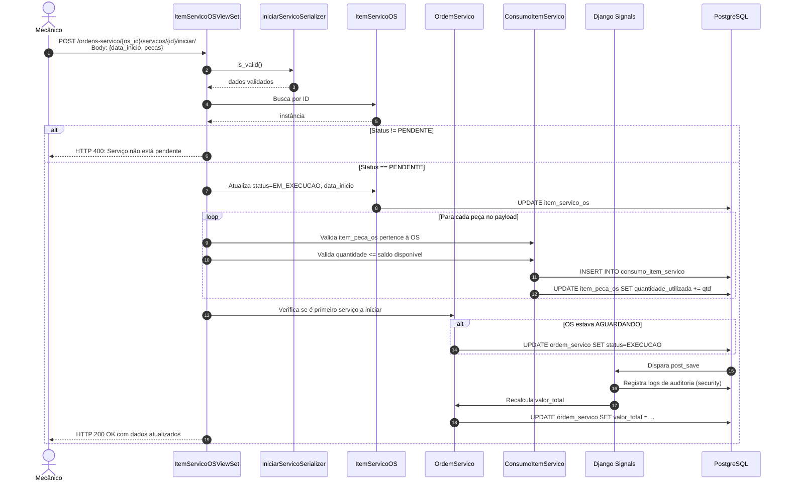
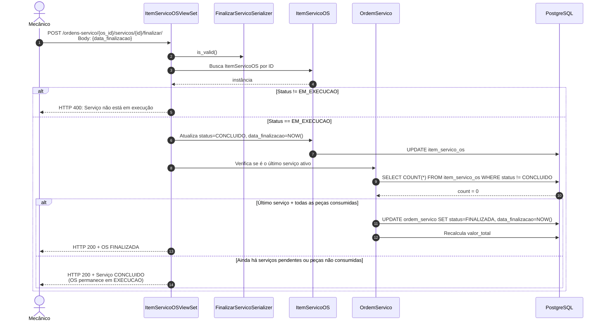

# Low-Level Design (LLD) — Oficina Mecânica API

| Informação | Valor |
|---|---|
| **Documento** | Low-Level Design |
| **Versão** | 1.0 |
| **Data** | 2026-04-28 |
| **Autores** | Afonso Victoriano Franco (RM373563), Hélio Mendes da Silva (RM374170), João Pedro Rodrigues Martins (RM372818), Luís Fernando Montes (RM367183), Sophia Sussa Campos Bastos (RM371864) |

---

## 1. Introdução

O LLD detalha a implementação técnica da API, incluindo especificação de módulos, diagramas de sequência, contratos de API, estrutura do banco de dados e regras de negócio codificadas.

> **Renderização dos diagramas:** Cada diagrama de sequência possui duas versões: **PlantUML** (visual mais rico) e **Mermaid** (compatível com GitHub, Notion, VS Code). Use o [Mermaid Live Editor](https://mermaid.live/) para renderizar as versões Mermaid.

---

## 2. Estrutura de Módulos

```
atendimento/
├── __init__.py
├── admin.py              # Django Admin customizado
├── apps.py               # Configuração do app Django
├── auth_views.py         # Views auxiliares de autenticação
├── exceptions.py         # Handler de erro customizado
├── filters.py            # FilterSets (django-filter)
├── models.py             # Entidades de domínio + validadores
├── serializers.py        # Serializers + máquina de estados
├── signals.py            # Signals Django (recálculo + auditoria)
├── tests.py              # 76 testes (modelo + API)
├── throttles.py          # Rate limiting customizado
├── urls.py               # Roteamento da API (DefaultRouter)
├── views.py              # ViewSets (controllers)
└── migrations/
    ├── 0001_initial.py
    ├── 0002_ordemservico_data_finalizacao_and_more.py
    ├── 0003_cliente_created_by_itempecaos_created_by_and_more.py
    ├── 0004_itempecaos_quantidade_utilizada_itemservicoos_and_more.py
    └── 0005_alter_consumoitemservico_unique_together_and_more.py
```

---

## 3. Diagramas de Sequência

### 3.1 Iniciar Execução de Serviço

#### PlantUML

```plantuml
@startuml
!include https://raw.githubusercontent.com/plantuml-stdlib/C4-PlantUML/master/C4_Dynamic.puml

title LLD: Iniciar Serviço na OS

Participant(cliente, "Cliente HTTP")
Container_Boundary(api, "Django/DRF") {
    Participant(view, "ItemServicoOSViewSet", "View")
    Participant(action_ser, "IniciarServicoSerializer", "Serializer")
    Participant(item_ser, "ItemServicoOSSerializer", "Serializer")
    Participant(item_model, "ItemServicoOS", "Model")
    Participant(os_model, "OrdemServico", "Model")
    Participant(consumo_model, "ConsumoItemServico", "Model")
    Participant(signals, "Signals", "Django")
}
ContainerDb(db, "PostgreSQL", "Banco de Dados")

Rel(cliente, view, "POST /ordens-servico/{os_id}/servicos/{id}/iniciar/\nBody: {data_inicio, pecas}")
Rel(view, action_ser, "is_valid()")
Rel(action_ser, view, "Retorna dados validados")
Rel(view, item_model, "Busca ItemServicoOS por ID")
Rel(item_model, view, "Retorna instância")

alt Status != PENDENTE
    Rel(view, cliente, "HTTP 400: Serviço não está pendente")
else Status == PENDENTE
    Rel(view, item_model, "Atualiza status=EM_EXECUCAO, data_inicio")
    Rel(item_model, db, "UPDATE item_servico_os")

    loop Para cada peça no payload
        Rel(view, consumo_model, "Valida item_peca_os pertence à OS")
        Rel(view, consumo_model, "Valida quantidade <= saldo disponível")
        Rel(consumo_model, db, "INSERT INTO consumo_item_servico")
        Rel(consumo_model, db, "UPDATE item_peca_os SET quantidade_utilizada += qtd")
    end

    Rel(view, os_model, "Verifica se é primeiro serviço a iniciar")
    alt OS estava AGUARDANDO
        Rel(os_model, db, "UPDATE ordem_servico SET status=EXECUCAO")
    end

    Rel(db, signals, "Dispara post_save (ItemServicoOS, OrdemServico, ConsumoItemServico)")
    Rel(signals, db, "Registra logs de auditoria (security)")
    Rel(signals, os_model, "Recalcula valor_total")
    Rel(os_model, db, "UPDATE ordem_servico SET valor_total = ...")

    Rel(view, cliente, "HTTP 200 OK com ItemServicoOSSerializer(data)")
end

@enduml
```

#### Mermaid



---

### 3.2 Finalizar Serviço e Cascade para OS Finalizada

#### PlantUML

```plantuml
@startuml
!include https://raw.githubusercontent.com/plantuml-stdlib/C4-PlantUML/master/C4_Dynamic.puml

title LLD: Finalizar Serviço e Cascade OS → FINALIZADA

Participant(cliente, "Cliente HTTP")
Container_Boundary(api, "Django/DRF") {
    Participant(view, "ItemServicoOSViewSet", "View")
    Participant(action_ser, "FinalizarServicoSerializer", "Serializer")
    Participant(item_model, "ItemServicoOS", "Model")
    Participant(os_model, "OrdemServico", "Model")
}
ContainerDb(db, "PostgreSQL", "Banco de Dados")

Rel(cliente, view, "POST /ordens-servico/{os_id}/servicos/{id}/finalizar/")
Rel(view, action_ser, "is_valid()")
Rel(view, item_model, "Busca ItemServicoOS")

alt Status != EM_EXECUCAO
    Rel(view, cliente, "HTTP 400: Serviço não está em execução")
else
    Rel(item_model, db, "UPDATE status=CONCLUIDO, data_finalizacao=NOW()")
    Rel(view, os_model, "Verifica se é o último serviço ativo")
    Rel(os_model, db, "SELECT COUNT(*) FROM item_servico_os WHERE status != CONCLUIDO")

    alt Último serviço + todas as peças consumidas
        Rel(os_model, db, "UPDATE ordem_servico SET status=FINALIZADA, data_finalizacao=NOW()")
        Rel(os_model, db, "Recalcula valor_total")
        Rel(view, cliente, "HTTP 200 + OS FINALIZADA")
    else Ainda há serviços pendentes ou peças não consumidas
        Rel(view, cliente, "HTTP 200 + Serviço CONCLUIDO (OS permanece em EXECUCAO)")
    end
end

@enduml
```

#### Mermaid



---

## 4. Especificação de APIs

### 4.1 Clientes

| Método | Endpoint | Request | Response | Auth |
|---|---|---|---|---|
| GET | `/api/v1/clientes/` | Query: `?nome=joão&documento=529...` | Lista paginada | Sim |
| POST | `/api/v1/clientes/` | Body: `{nome, documento, email, telefone}` | Objeto criado | Sim |
| GET | `/api/v1/clientes/{id}/` | — | Objeto detalhado | Sim |
| PUT | `/api/v1/clientes/{id}/` | Body completo | Objeto atualizado | Sim |
| PATCH | `/api/v1/clientes/{id}/` | Body parcial | Objeto atualizado | Sim |
| DELETE | `/api/v1/clientes/{id}/` | — | 204 No Content | Sim |

### 4.2 Ordens de Serviço

| Método | Endpoint | Request | Response | Auth |
|---|---|---|---|---|
| GET | `/api/v1/ordens-servico/` | Query: `?status=EXECUCAO&cliente=1` | Lista paginada | Sim |
| POST | `/api/v1/ordens-servico/` | Body: `{cliente, veiculo}` | OS criada (RECEBIDA) | Sim |
| GET | `/api/v1/ordens-servico/{id}/` | — | OS detalhada | Sim |
| PATCH | `/api/v1/ordens-servico/{id}/` | Body: `{status}` | OS atualizada | Sim |
| DELETE | `/api/v1/ordens-servico/{id}/` | — | 204 No Content | Sim |
| GET | `/api/v1/ordens-servico/consulta-cliente/` | Query: `?placa=ABC1234` ou `?documento=529...` | OS pública | **Não** |

### 4.3 Serviços por OS

| Método | Endpoint | Request | Response | Auth |
|---|---|---|---|---|
| POST | `/api/v1/ordens-servico/{os_id}/servicos/` | Body: `{servico}` | Serviço adicionado (PENDENTE) | Sim |
| POST | `/api/v1/ordens-servico/{os_id}/servicos/{id}/iniciar/` | Body: `{data_inicio, pecas}` | Serviço EM_EXECUCAO | Sim |
| POST | `/api/v1/ordens-servico/{os_id}/servicos/{id}/finalizar/` | Body: `{data_finalizacao}` | Serviço CONCLUIDO | Sim |
| DELETE | `/api/v1/ordens-servico/{os_id}/servicos/{id}/` | — | 204 (somente PENDENTE) | Sim |

---

## 5. Estrutura do Banco de Dados

### 5.1 Tabelas e Campos

```sql
CREATE TABLE cliente (
    id SERIAL PRIMARY KEY,
    nome VARCHAR(255) NOT NULL,
    documento VARCHAR(14) UNIQUE NOT NULL,
    email VARCHAR(254) NOT NULL,
    telefone VARCHAR(20) NOT NULL,
    criado_em TIMESTAMP WITH TIME ZONE DEFAULT NOW(),
    created_by_id INTEGER REFERENCES auth_user(id) ON DELETE SET NULL
);

CREATE TABLE veiculo (
    id SERIAL PRIMARY KEY,
    placa VARCHAR(7) UNIQUE NOT NULL,
    marca VARCHAR(50) NOT NULL,
    modelo VARCHAR(50) NOT NULL,
    ano INTEGER NOT NULL,
    cliente_id INTEGER NOT NULL REFERENCES cliente(id) ON DELETE CASCADE,
    created_by_id INTEGER REFERENCES auth_user(id) ON DELETE SET NULL
);

CREATE TABLE servico (
    id SERIAL PRIMARY KEY,
    descricao VARCHAR(255) NOT NULL,
    valor_mao_de_obra DECIMAL(10,2) NOT NULL,
    created_by_id INTEGER REFERENCES auth_user(id) ON DELETE SET NULL
);

CREATE TABLE peca (
    id SERIAL PRIMARY KEY,
    nome VARCHAR(255) NOT NULL,
    valor_unitario DECIMAL(10,2) NOT NULL,
    estoque_atual INTEGER DEFAULT 0,
    created_by_id INTEGER REFERENCES auth_user(id) ON DELETE SET NULL
);

CREATE TABLE ordem_servico (
    id SERIAL PRIMARY KEY,
    status VARCHAR(20) DEFAULT 'RECEBIDA',
    data_abertura TIMESTAMP WITH TIME ZONE DEFAULT NOW(),
    data_inicio_execucao TIMESTAMP WITH TIME ZONE NULL,
    data_finalizacao TIMESTAMP WITH TIME ZONE NULL,
    valor_total DECIMAL(10,2) DEFAULT 0.00,
    cliente_id INTEGER NOT NULL REFERENCES cliente(id) ON DELETE PROTECT,
    veiculo_id INTEGER NOT NULL REFERENCES veiculo(id) ON DELETE PROTECT,
    created_by_id INTEGER REFERENCES auth_user(id) ON DELETE SET NULL
);

CREATE TABLE item_peca_os (
    id SERIAL PRIMARY KEY,
    quantidade INTEGER NOT NULL DEFAULT 1,
    quantidade_utilizada INTEGER NOT NULL DEFAULT 0,
    os_id INTEGER NOT NULL REFERENCES ordem_servico(id) ON DELETE CASCADE,
    peca_id INTEGER NOT NULL REFERENCES peca(id) ON DELETE PROTECT,
    created_by_id INTEGER REFERENCES auth_user(id) ON DELETE SET NULL
);

CREATE TABLE item_servico_os (
    id SERIAL PRIMARY KEY,
    status VARCHAR(20) DEFAULT 'PENDENTE',
    data_inicio TIMESTAMP WITH TIME ZONE NULL,
    data_finalizacao TIMESTAMP WITH TIME ZONE NULL,
    ordem_servico_id INTEGER NOT NULL REFERENCES ordem_servico(id) ON DELETE CASCADE,
    servico_id INTEGER NOT NULL REFERENCES servico(id) ON DELETE PROTECT,
    created_by_id INTEGER REFERENCES auth_user(id) ON DELETE SET NULL,
    UNIQUE (ordem_servico_id, servico_id)
);

CREATE TABLE consumo_item_servico (
    id SERIAL PRIMARY KEY,
    quantidade INTEGER NOT NULL,
    item_servico_os_id INTEGER NOT NULL REFERENCES item_servico_os(id) ON DELETE CASCADE,
    item_peca_os_id INTEGER NOT NULL REFERENCES item_peca_os(id) ON DELETE PROTECT,
    UNIQUE (item_servico_os_id, item_peca_os_id)
);
```

### 5.2 Constraints Importantes

| Constraint | Tabela | Descrição |
|---|---|---|
| `UNIQUE (documento)` | `cliente` | CPF/CNPJ único |
| `UNIQUE (placa)` | `veiculo` | Placa única |
| `UNIQUE (ordem_servico_id, servico_id)` | `item_servico_os` | Serviço único por OS |
| `UNIQUE (item_servico_os_id, item_peca_os_id)` | `consumo_item_servico` | Consumo único por par serviço-peça |
| `ON DELETE PROTECT` | `ordem_servico` → `cliente/veiculo` | Impede exclusão de cliente/veículo com OS vinculada |
| `ON DELETE CASCADE` | `item_peca_os` → `ordem_servico` | Remove itens ao excluir OS |

---

## 6. Regras de Negócio Implementadas

### 6.1 Validação de Transição de Status (Máquina de Estados)

**Local:** `OrdemServicoSerializer.validate_status()`

```python
TRANSICOES_VALIDAS = {
    'RECEBIDA':    ['DIAGNOSTICO'],
    'DIAGNOSTICO': ['AGUARDANDO'],
    'AGUARDANDO':  ['EXECUCAO'],
    'EXECUCAO':    ['FINALIZADA'],
    'FINALIZADA':  ['ENTREGUE'],
    'ENTREGUE':    [],
}
```

### 6.2 Validação de Estoque

**Local:** `ItemPecaOS.save()` e `ItemPecaOSSerializer.validate()`

- Criação: `peca.estoque_atual >= quantidade`
- Atualização: `peca.estoque_atual >= (nova_quantidade - quantidade_anterior)`

### 6.3 Gates de Finalização da OS

**Local:** `OrdemServicoSerializer.validate_status()`

- `FINALIZADA` exige: `itens_servico.status == 'CONCLUIDO'` para todos
- `FINALIZADA` exige: `itens_pecas.quantidade_utilizada == quantidade` para todos

### 6.4 Recálculo de Valor Total

**Local:** `OrdemServico.calcular_total()` + Signals

```python
total_servicos = sum(s.valor_mao_de_obra for s in self.servicos.all())
total_pecas = sum(item.total_item for item in self.itens_pecas.all())
novo_total = total_servicos + total_pecas
OrdemServico.objects.filter(pk=self.pk).update(valor_total=novo_total)
```

> Usa `.update()` para evitar recursão de signals.

---

## 7. Histórico de Revisões

| Versão | Data | Autor | Descrição |
|---|---|---|---|
| 1.0 | 2026-04-28 | Afonso Victoriano Franco, Hélio Mendes da Silva, João Pedro Rodrigues Martins, Luís Fernando Montes, Sophia Sussa Campos Bastos | Versão inicial |
