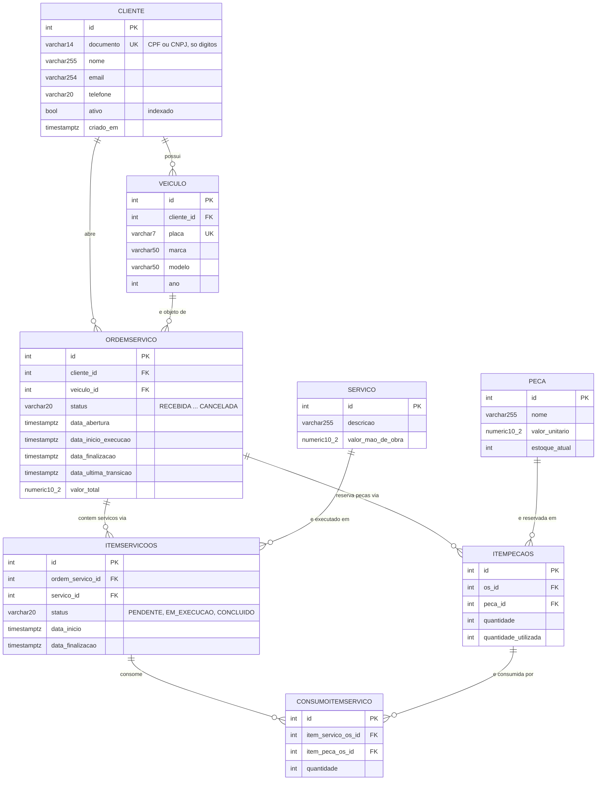

# Justificativa Formal do Banco de Dados

## 1. Escolha do Banco: PostgreSQL

### 1.1 Por que PostgreSQL?

| Critério | PostgreSQL | MySQL | SQL Server |
|---|---|---|---|
| **Custo** | Gratuito (open source) | Gratuito (community) | Pago (licença) |
| **JSON nativo** | `JSONB` com indexação | JSON limitado | JSON limitado |
| **Extensões** | pg_stat_statements, PostGIS | Poucas | Poucas |
| **Performance** | Excelente para leituras | Excelente para escritas | Balanceado |
| **AWS** | RDS gerenciado | RDS gerenciado | RDS gerenciado |
| **Comunidade** | Grande | Grande | Microsoft |

### 1.2 Justificativa para o projeto

1. **JSONB**: disponível para metadados flexíveis no futuro (hoje nenhum campo do modelo usa JSON)
2. **pg_stat_statements**: essencial para monitoramento de performance (requisito do Tech Challenge)
3. **Performance Insights**: nativo no RDS, permite identificar queries lentas
4. **Custo**: gratuito, essencial para projeto acadêmico
5. **Django ORM**: suporte nativo e robusto

## 2. Modelo ER

Fonte da verdade: `atendimento/models.py` e as migrations `0001` a `0008`. Os nomes de tabela
seguem a convenção do Django (`<app>_<model>` em minúsculas). Todas as tabelas de negócio têm
`created_by_id` (FK opcional para `auth_user`, `ON DELETE SET NULL`) para auditoria de quem criou o
registro; a coluna foi omitida do diagrama para caber na página.

### 2.1 Entidades e Relacionamentos



### 2.2 Relacionamentos

| Relacionamento | Tipo | Como está no código | Regra de exclusão |
|---|---|---|---|
| Cliente → Veiculo | 1:N | `Veiculo.cliente` (FK) | `CASCADE` — apagar o cliente apaga os veículos |
| Cliente → OrdemServico | 1:N | `OrdemServico.cliente` (FK) | `PROTECT` — cliente com OS não pode ser apagado |
| Veiculo → OrdemServico | 1:N | `OrdemServico.veiculo` (FK) | `PROTECT` |
| OrdemServico ↔ Servico | N:N | `OrdemServico.servicos = ManyToManyField(Servico, through='ItemServicoOS')` | par `(ordem_servico, servico)` único |
| OrdemServico ↔ Peca | N:N | `ItemPecaOS` (FK para os dois lados) | `CASCADE` na OS, `PROTECT` na peça |
| ItemServicoOS ↔ ItemPecaOS | N:N | `ConsumoItemServico` — quais peças reservadas cada serviço consumiu | par `(item_servico_os, item_peca_os)` único |

`Servico` e `Peca` são **catálogos**: não pertencem a uma OS. O vínculo com a OS é sempre pela
tabela intermediária, que carrega o estado do item (status do serviço, quantidade reservada e
utilizada da peça). É isso que permite o mesmo serviço do catálogo aparecer em várias OS com ciclos
de vida independentes.

### 2.3 Tabelas e Campos

Tipos na notação do PostgreSQL gerado pelo Django. `created_by_id` (INTEGER, FK → `auth_user.id`,
NULL, `ON DELETE SET NULL`) existe em todas as tabelas abaixo exceto `atendimento_consumoitemservico`
e foi omitida das listas.

#### atendimento_cliente
| Campo | Tipo | Restrição | Descrição |
|---|---|---|---|
| id | SERIAL | PK | Identificador único |
| nome | VARCHAR(255) | NOT NULL | Nome completo ou razão social |
| documento | VARCHAR(14) | UNIQUE, NOT NULL | CPF (11 dígitos) ou CNPJ (14 dígitos), validado por dígito verificador na aplicação |
| email | VARCHAR(254) | NOT NULL | E-mail de contato (sem unicidade no banco) |
| telefone | VARCHAR(20) | NOT NULL | Telefone de contato |
| ativo | BOOLEAN | NOT NULL, DEFAULT TRUE, índice | Cliente inativo não recebe JWT na Lambda de autenticação |
| criado_em | TIMESTAMPTZ | NOT NULL | Preenchido automaticamente na criação |

#### atendimento_veiculo
| Campo | Tipo | Restrição | Descrição |
|---|---|---|---|
| id | SERIAL | PK | Identificador único |
| cliente_id | INTEGER | FK → cliente.id, CASCADE | Dono do veículo |
| placa | VARCHAR(7) | UNIQUE, NOT NULL | Formato antigo (`ABC1234`) ou Mercosul (`ABC1D23`) |
| marca | VARCHAR(50) | NOT NULL | Marca |
| modelo | VARCHAR(50) | NOT NULL | Modelo |
| ano | INTEGER | NOT NULL, ≥ 0 | Ano de fabricação |

#### atendimento_servico (catálogo)
| Campo | Tipo | Restrição | Descrição |
|---|---|---|---|
| id | SERIAL | PK | Identificador único |
| descricao | VARCHAR(255) | NOT NULL | Descrição do serviço |
| valor_mao_de_obra | NUMERIC(10,2) | NOT NULL | Valor cobrado pela mão de obra |

#### atendimento_peca (catálogo + estoque)
| Campo | Tipo | Restrição | Descrição |
|---|---|---|---|
| id | SERIAL | PK | Identificador único |
| nome | VARCHAR(255) | NOT NULL | Nome da peça |
| valor_unitario | NUMERIC(10,2) | NOT NULL | Preço unitário |
| estoque_atual | INTEGER | NOT NULL, DEFAULT 0 | Saldo em estoque; debitado ao reservar em uma OS e devolvido ao remover |

#### atendimento_ordemservico
| Campo | Tipo | Restrição | Descrição |
|---|---|---|---|
| id | SERIAL | PK | Identificador único |
| cliente_id | INTEGER | FK → cliente.id, PROTECT | Cliente da OS |
| veiculo_id | INTEGER | FK → veiculo.id, PROTECT | Veículo da OS |
| status | VARCHAR(20) | NOT NULL, DEFAULT 'RECEBIDA' | `RECEBIDA` → `DIAGNOSTICO` → `AGUARDANDO` → `EXECUCAO` → `FINALIZADA` → `ENTREGUE`; `CANCELADA` a partir de `AGUARDANDO` |
| data_abertura | TIMESTAMPTZ | NOT NULL | Preenchida na criação |
| data_inicio_execucao | TIMESTAMPTZ | NULL | Preenchida na transição para `EXECUCAO` |
| data_finalizacao | TIMESTAMPTZ | NULL | Preenchida na transição para `FINALIZADA` |
| data_ultima_transicao | TIMESTAMPTZ | NULL | Instante da última mudança de status; NULL em OS anteriores à migration `0007` |
| valor_total | NUMERIC(10,2) | NOT NULL, DEFAULT 0 | Σ mão de obra dos serviços + Σ (valor unitário × quantidade) das peças; recalculado a cada alteração de item |

#### atendimento_itemservicoos (OS ↔ Serviço)
| Campo | Tipo | Restrição | Descrição |
|---|---|---|---|
| id | SERIAL | PK | Identificador único |
| ordem_servico_id | INTEGER | FK → ordemservico.id, CASCADE | OS |
| servico_id | INTEGER | FK → servico.id, PROTECT | Serviço do catálogo |
| status | VARCHAR(20) | NOT NULL, DEFAULT 'PENDENTE' | `PENDENTE` / `EM_EXECUCAO` / `CONCLUIDO` |
| data_inicio | TIMESTAMPTZ | NULL | Início da execução do serviço |
| data_finalizacao | TIMESTAMPTZ | NULL | Fim da execução; a diferença dá o tempo de execução em minutos |
| — | — | UNIQUE (ordem_servico_id, servico_id) | O mesmo serviço não entra duas vezes na mesma OS |

#### atendimento_itempecaos (OS ↔ Peça)
| Campo | Tipo | Restrição | Descrição |
|---|---|---|---|
| id | SERIAL | PK | Identificador único |
| os_id | INTEGER | FK → ordemservico.id, CASCADE | OS |
| peca_id | INTEGER | FK → peca.id, PROTECT | Peça do catálogo |
| quantidade | INTEGER | NOT NULL, DEFAULT 1, ≥ 0 | Quantidade reservada (debitada do estoque) |
| quantidade_utilizada | INTEGER | NOT NULL, DEFAULT 0, ≤ quantidade | Quantidade efetivamente consumida; a OS só finaliza quando `quantidade_utilizada = quantidade` em todos os itens |

#### atendimento_consumoitemservico (Serviço da OS ↔ Peça da OS)
| Campo | Tipo | Restrição | Descrição |
|---|---|---|---|
| id | SERIAL | PK | Identificador único |
| item_servico_os_id | INTEGER | FK → itemservicoos.id, CASCADE | Serviço da OS que consumiu |
| item_peca_os_id | INTEGER | FK → itempecaos.id, PROTECT | Peça reservada que foi consumida |
| quantidade | INTEGER | NOT NULL, ≥ 0 | Quantidade consumida por este serviço |
| — | — | UNIQUE (item_servico_os_id, item_peca_os_id) | Um lançamento por par serviço/peça |

### 2.4 Índices

Índices que **existem** no banco (criados pelo Django a partir do model e das migrations):

| Tabela | Índice | Origem | Motivo |
|---|---|---|---|
| atendimento_cliente | `documento` (UNIQUE) | `unique=True` | Busca por CPF na Lambda de autenticação e unicidade do cadastro |
| atendimento_cliente | `ativo` | `db_index=True` (migration `0008`) | A Lambda filtra cliente ativo antes de emitir o JWT |
| atendimento_veiculo | `placa` (UNIQUE) | `unique=True` | Consulta pública de OS por placa |
| atendimento_veiculo | `cliente_id` | índice automático de FK | Listar veículos do cliente (isolamento do Cliente JWT) |
| atendimento_ordemservico | `cliente_id`, `veiculo_id` | índices automáticos de FK | Listar OS do cliente / do veículo |
| atendimento_itemservicoos | `(ordem_servico_id, servico_id)` (UNIQUE) + FKs | `unique_together` | Serviços de uma OS |
| atendimento_itempecaos | `os_id`, `peca_id` | índices automáticos de FK | Peças de uma OS |
| atendimento_consumoitemservico | `(item_servico_os_id, item_peca_os_id)` (UNIQUE) + FKs | `unique_together` | Consumo por serviço |

Não há índice em `status`, `data_abertura` nem composto `(cliente_id, status)`. Ver 3.2 para os
candidatos e o critério de criação.

### 2.5 Queries Principais

```sql
-- Autenticação de cliente (Lambda do repositório tech-challenge-oficina-auth).
-- A coluna é `documento`; a Lambda tenta o CPF só com dígitos e o formatado,
-- e prefere o primeiro. Usuário read-only: qualquer INSERT/UPDATE/DELETE falha com 42501.
SELECT id, ativo
FROM atendimento_cliente
WHERE documento = %s OR documento = %s
ORDER BY CASE WHEN documento = %s THEN 0 ELSE 1 END
LIMIT 1;

-- Abertura de OS (POST /api/v1/ordens-servico/ ou /abrir/): nasce RECEBIDA com total zero
INSERT INTO atendimento_ordemservico
    (cliente_id, veiculo_id, status, data_abertura, valor_total, created_by_id)
VALUES (%s, %s, 'RECEBIDA', NOW(), 0.00, %s)
RETURNING id;

-- OS do cliente autenticado por JWT (isolamento por cliente_id do token)
SELECT id, status, valor_total, data_abertura
FROM atendimento_ordemservico
WHERE cliente_id = %s
ORDER BY data_abertura DESC;

-- Serviços de uma OS com o status de cada um (relação N:N via ItemServicoOS)
SELECT s.descricao, s.valor_mao_de_obra, i.status, i.data_inicio, i.data_finalizacao
FROM atendimento_itemservicoos i
JOIN atendimento_servico s ON s.id = i.servico_id
WHERE i.ordem_servico_id = %s;

-- Tempo médio de atendimento (GET /api/v1/ordens-servico/metricas/tempo-medio/)
SELECT AVG(EXTRACT(EPOCH FROM data_finalizacao - data_abertura)) / 60 AS minutos
FROM atendimento_ordemservico
WHERE status IN ('FINALIZADA', 'ENTREGUE') AND data_finalizacao IS NOT NULL;
```

A aplicação não escreve SQL à mão: as queries acima são o que o Django ORM emite para os
endpoints indicados, e servem para leitura do Performance Insights. A única exceção é a Lambda,
que usa `pg8000` com a query literal do primeiro bloco.

## 3. Performance e Monitoramento

### 3.1 Performance Insights (RDS)

| Configuração | Valor | Motivo |
|---|---|---|
| retention_period | 7 | Tier gratuito |
| log_min_duration_statement | 1000 | Logar queries > 1s |
| pg_stat_statements.track | all | Rastrear todas as queries |
| track_io_timing | 1 | Medir I/O |

### 3.2 Consultas Lentas Identificadas

| Query | Situação hoje | Próximo passo se o Performance Insights acusar |
|---|---|---|
| OS por cliente (`WHERE cliente_id = ?`) | atendida pelo índice de FK que o Django cria | — |
| Contagem/listagem por status (`WHERE cliente_id = ? AND status = ?`) | só o índice de FK; `status` é filtrado em memória | índice composto `(cliente_id, status)` |
| Relatórios por período (`WHERE data_abertura BETWEEN ...`) | sem índice, faz seq scan | índice em `data_abertura` |

Nenhum desses índices adicionais foi criado: o volume de dados do projeto não justifica antes de
uma medição real. A tabela acima registra a decisão para que a criação, se vier, seja uma migration
consciente e não um palpite.

## 4. Histórico de Revisões

| Versão | Data | Autor | Descrição |
|---|---|---|---|
| 1.0 | 2026-09-08 | Hélio Mendes | Versão inicial |
| 1.1 | 2026-09-12 | Luís Fernando Montes | Modelo ER, tabelas, índices e queries alinhados a `atendimento/models.py` (coluna `documento`, status `RECEBIDA`, N:N via `ItemServicoOS`/`ItemPecaOS`/`ConsumoItemServico`); separados índices existentes de candidatos |
